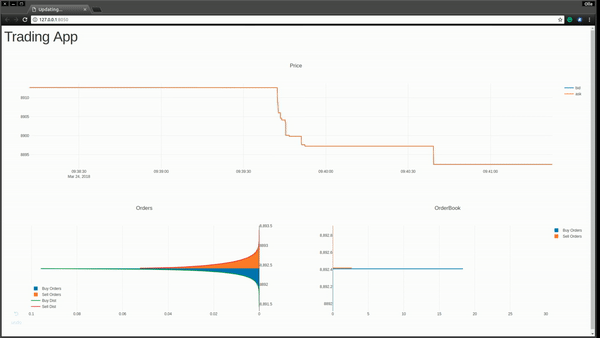

This repository contains an level 3 order book simulation for data from the GDAX API. The simulation is made so that it 
fit the abstract API of a OpenAI gym class.

The simulation of the order book is inpspired by .. but modified and cythonized.

# Dependencies
A conda environment yaml exists.  
conda env create -f environment.yml  
To build cython  
python setup.py build_ext --inplace

But other python dependecies exists  
for OpenAI  
[Install everything](https://github.com/openai/gym#installing-everything)  
for Ray  
[Dependencies](http://ray.readthedocs.io/en/latest/installation.html)

# Data
The data can be downloaded by download.js, and then converted to the feather format by running
"Save data as Feather.ipynb"

## Temporary Data
A smaller data set exists at  
[data](https://1drv.ms/f/s!AvDTSDzCQgF0rdQW_w9dq-FQxefuXw)

# Reinforcement Learning
One class is currently developed, where the action space is the alpha and beta of a gamma distribution. So the buy and sell
limit orders are placed according to a gamma distribution, see MarketBetaEnv

## Policy optimization
The policy is optimized using PPO.

## Rendering
The environment can be rendered as a dash app. Under development.

